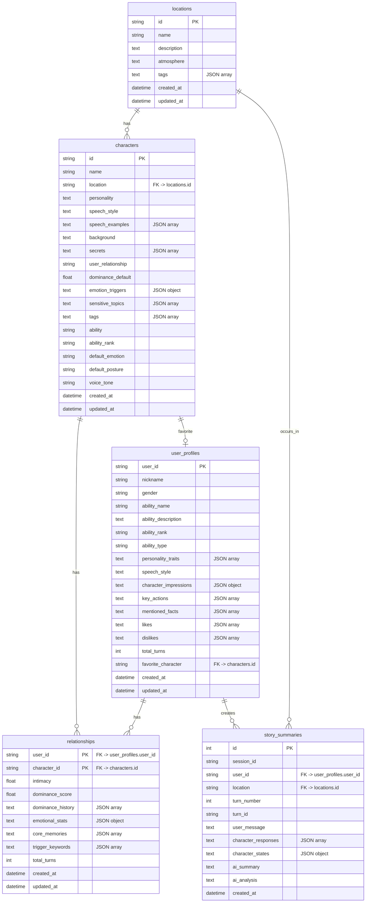
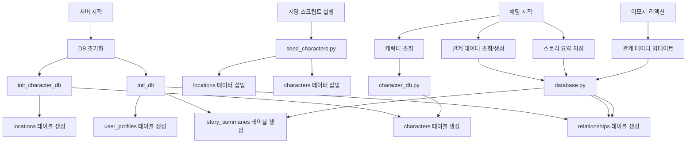

# 데이터베이스 구조 시각화

## 📊 전체 데이터베이스 ERD



## 🗂️ 테이블별 상세 구조

### 1. `locations` (장소)

```
┌─────────────────────────────────────────┐
│           locations                     │
├─────────────────────────────────────────┤
│ PK  id              VARCHAR             │
│     name            VARCHAR(50)         │
│     description     TEXT                │
│     atmosphere      TEXT                │
│     tags            TEXT (JSON array)   │
│     created_at      DATETIME            │
│     updated_at      DATETIME            │
└─────────────────────────────────────────┘
```

**용도**: 게임 내 장소 정보 저장
**시딩**: `scripts/seed_characters.py`로 4개 장소 시딩

---

### 2. `characters` (캐릭터)

```
┌─────────────────────────────────────────┐
│           characters                    │
├─────────────────────────────────────────┤
│ PK  id              VARCHAR             │
│     name            VARCHAR(50)         │
│     location        VARCHAR (index)     │
│     personality     TEXT                │
│     speech_style    TEXT                │
│     speech_examples TEXT (JSON array)   │
│     background      TEXT                │
│     secrets         TEXT (JSON array)   │
│     user_relationship VARCHAR(50)       │
│     dominance_default REAL              │
│     emotion_triggers TEXT (JSON object) │
│     sensitive_topics TEXT (JSON array)  │
│     tags            TEXT (JSON array)   │
│     ability         VARCHAR(50)         │
│     ability_rank    VARCHAR(10)         │
│     default_emotion VARCHAR(50)          │
│     default_posture VARCHAR(50)         │
│     voice_tone      VARCHAR(50)         │
│     created_at      DATETIME            │
│     updated_at      DATETIME            │
└─────────────────────────────────────────┘
```

**용도**: NPC 캐릭터 정보 및 페르소나 저장
**시딩**: `scripts/seed_characters.py`로 9명 캐릭터 시딩
**관계**: `location` → `locations.id` (논리적)

---

### 3. `relationships` (관계 데이터)

```
┌─────────────────────────────────────────┐
│         relationships                   │
├─────────────────────────────────────────┤
│ PK  user_id         VARCHAR             │
│ PK  character_id    VARCHAR             │
│     intimacy        REAL                │
│     dominance_score REAL                │
│     dominance_history TEXT (JSON array) │
│     emotional_stats TEXT (JSON object)  │
│     core_memories   TEXT (JSON array)  │
│     trigger_keywords TEXT (JSON array)  │
│     total_turns     INTEGER             │
│     created_at      DATETIME            │
│     updated_at      DATETIME            │
└─────────────────────────────────────────┘
```

**용도**: 유저와 캐릭터 간의 동적 관계 데이터 저장
- 친밀도, 권력 구조(Dominance), 감정 통계
- 핵심 기억, 트리거 키워드
**관계**: 
- `user_id` → `user_profiles.user_id` (논리적)
- `character_id` → `characters.id` (논리적)

---

### 4. `user_profiles` (유저 프로필)

```
┌─────────────────────────────────────────┐
│         user_profiles                  │
├─────────────────────────────────────────┤
│ PK  user_id         VARCHAR             │
│     nickname        VARCHAR(50)         │
│     gender          VARCHAR(10)        │
│     ability_name    VARCHAR(50)         │
│     ability_description TEXT            │
│     ability_rank    VARCHAR(10)         │
│     ability_type    VARCHAR(50)         │
│     personality_traits TEXT (JSON array)│
│     speech_style    TEXT                │
│     character_impressions TEXT (JSON)   │
│     key_actions     TEXT (JSON array)   │
│     mentioned_facts TEXT (JSON array)   │
│     likes           TEXT (JSON array)  │
│     dislikes        TEXT (JSON array)  │
│     total_turns     INTEGER             │
│     favorite_character VARCHAR          │
│     created_at      DATETIME            │
│     updated_at      DATETIME            │
└─────────────────────────────────────────┘
```

**용도**: 주인공(유저) 정보 저장
- 대화를 통해 자동으로 업데이트됨
- 캐릭터들이 유저를 기억하고 개인화된 반응에 사용
**관계**: `favorite_character` → `characters.id` (논리적)

---

### 5. `story_summaries` (스토리 요약)

```
┌─────────────────────────────────────────┐
│        story_summaries                  │
├─────────────────────────────────────────┤
│ PK  id              INTEGER (AUTO)      │
│     session_id      VARCHAR (index)      │
│     user_id        VARCHAR (index)      │
│     location       VARCHAR              │
│     turn_number     INTEGER             │
│     turn_id        VARCHAR              │
│     user_message   TEXT                 │
│     character_responses TEXT (JSON array)│
│     character_states TEXT (JSON object) │
│     ai_summary     TEXT                 │
│     ai_analysis    TEXT                 │
│     created_at     DATETIME             │
└─────────────────────────────────────────┘
```

**용도**: 대화 내용 및 AI 분석 요약 저장
- 각 턴별 대화 내용과 캐릭터 상태
- AI가 생성한 스토리 요약 및 분석
**관계**: 
- `user_id` → `user_profiles.user_id` (논리적)
- `location` → `locations.id` (논리적)

---

## 🔄 데이터 흐름도



## 📈 테이블별 데이터 예시

### locations 예시
```json
{
  "id": "베타_동_로비",
  "name": "베타 동 로비",
  "description": "빌런과 기숙사 1층 로비",
  "atmosphere": "긴장감이 감도는 분위기",
  "tags": ["핫플레이스", "위험", "빌런과"]
}
```

### characters 예시
```json
{
  "id": "npc_joo_changyun",
  "name": "주창윤",
  "location": "베타_동_로비",
  "personality": "오만하고 건방진 재벌 2세",
  "speech_style": "재수 없는 반말",
  "ability": "투명화",
  "ability_rank": "C"
}
```

### relationships 예시
```json
{
  "user_id": "user_123",
  "character_id": "npc_joo_changyun",
  "intimacy": 2.5,
  "dominance_score": 0.3,
  "dominance_history": [0.0, 0.2, 0.3],
  "emotional_stats": {
    "joy_peaks": 1,
    "anger_peaks": 3
  },
  "core_memories": [
    {
      "summary": "주창윤의 상의를 찢음",
      "emotion": "anger"
    }
  ]
}
```

## 🔗 주요 관계 요약

| 관계 | 설명 |
|------|------|
| `characters.location` → `locations.id` | 캐릭터가 위치한 장소 |
| `relationships.user_id` → `user_profiles.user_id` | 유저의 관계 데이터 |
| `relationships.character_id` → `characters.id` | 캐릭터와의 관계 |
| `story_summaries.user_id` → `user_profiles.user_id` | 유저의 대화 기록 |
| `story_summaries.location` → `locations.id` | 대화가 발생한 장소 |
| `user_profiles.favorite_character` → `characters.id` | 유저가 가장 좋아하는 캐릭터 |

## 📝 JSON 필드 상세

### characters.speech_examples
```json
["하... 거지 같네.", "야, 너 뭐야? 꺼져."]
```

### relationships.core_memories
```json
[
  {
    "summary": "주창윤의 상의를 찢음",
    "memorable_quote": "감히 네가?",
    "timestamp": "2024-01-01T12:00:00",
    "emotion": "anger"
  }
]
```

### user_profiles.character_impressions
```json
{
  "npc_joo_changyun": {
    "status": "적대적",
    "impression": "만만해 보이는 놈",
    "key_events": ["상의를 찢음"]
  }
}
```
